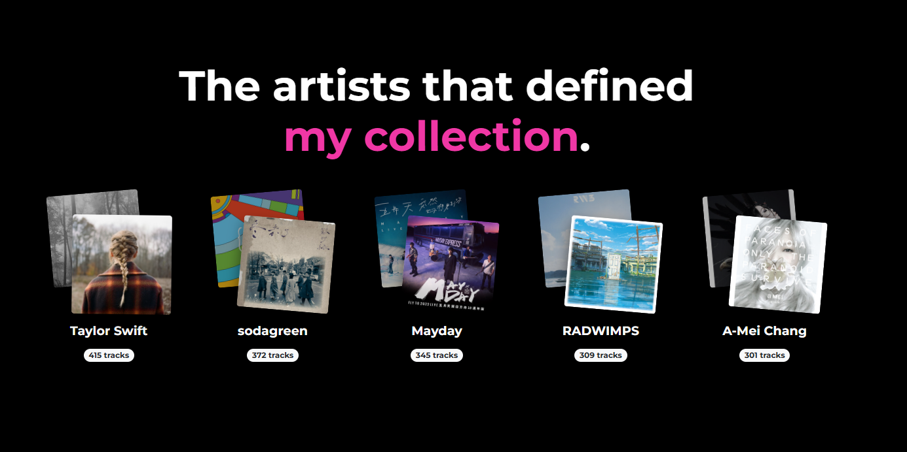
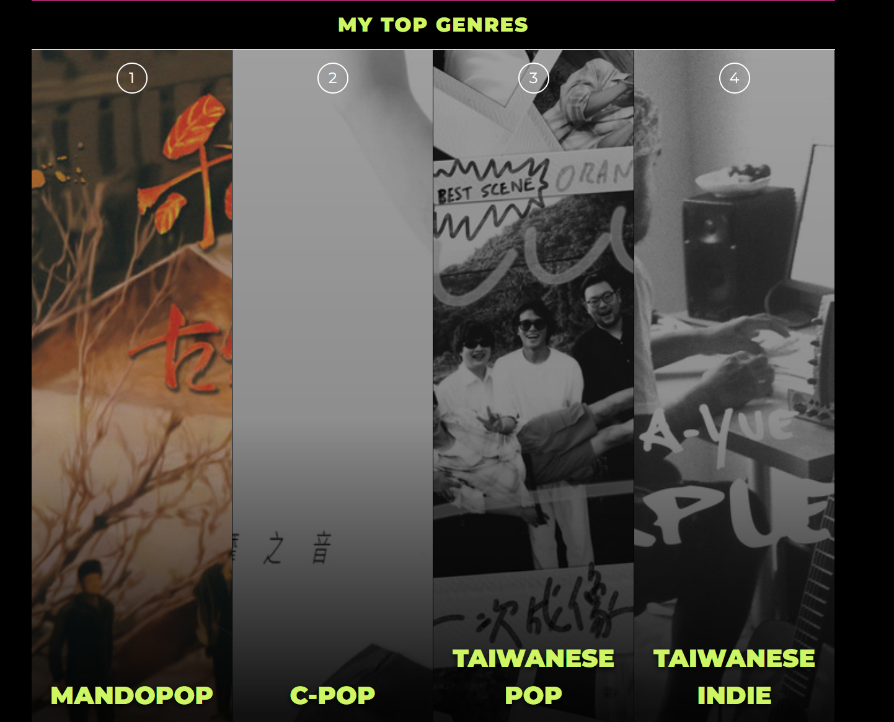
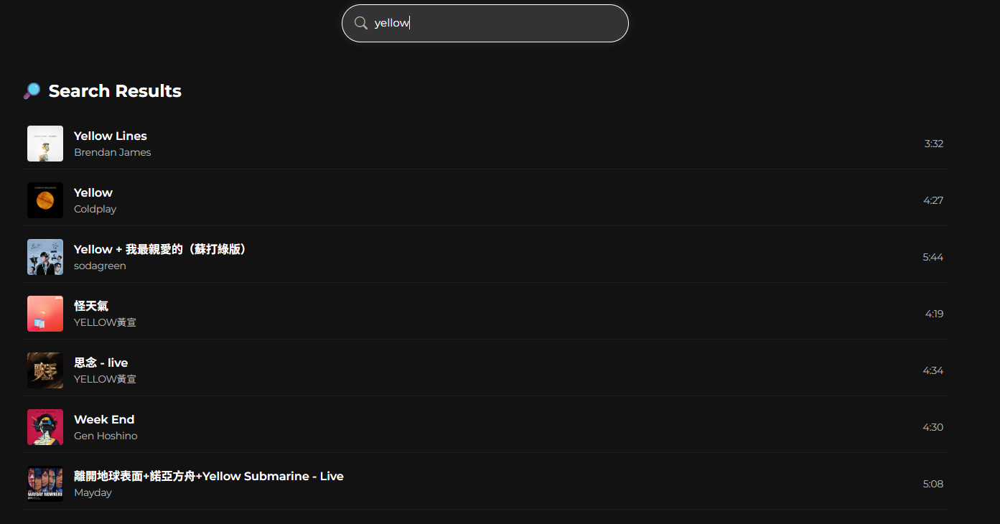
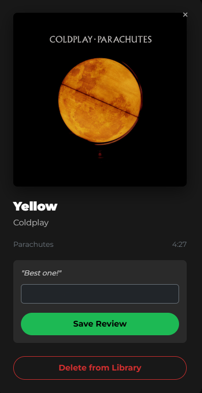
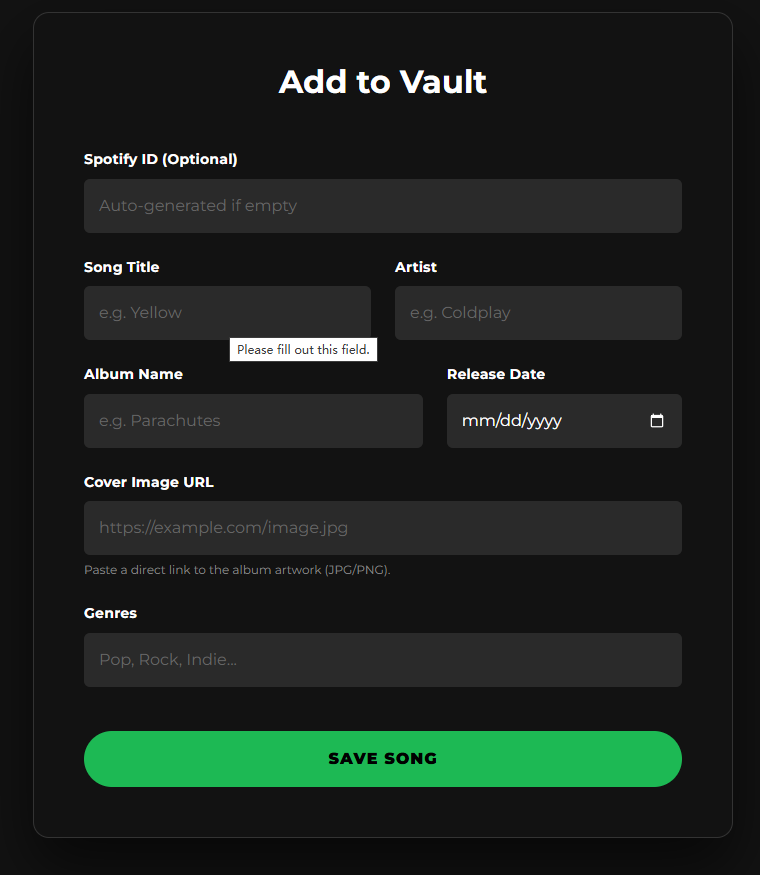
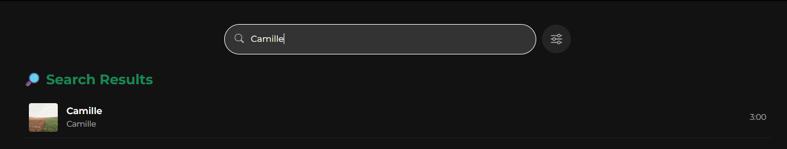

# **MyMusicVault**

**Author:** Zhiqi Zhang  
**Email:** zhiqi.zhang@vanderbilt.edu  
**Project:** DS5760 NoSQL for Modern Data Science Applications Final Project  

MyMusicVault is a personal music analytics and collection platform powered by MongoDB.


## Project Purpose

Spotify Wrapped is a popular annual feature, but users often wish to access their listening insights without waiting for the end of the year. MyMusicVault solves this by empowering users to take control of their data. It establishes a personal, persistent database of music, enabling real-time analysis, advanced filtering, and manual collection management without relying solely on streaming platforms. It serves as a personal "vault" to archive, visualize, and manage your musical journey at any time.

### Tech Stack

- **Database:** MongoDB

- **Backend:** Python, Flask, PyMongo

- **Frontend:** HTML5, CSS3, Bootstrap 5, JavaScript

- **Data Source:** Spotify Web API (via spotipy)

- **Infrastructure:** Docker, Docker Compose

```text
MyMusicVault/
├── data/
│   ├── data.ipynb                       # Jupyter notebooks to get data
│   └── final_spotify_data_genres.json   # Data file
├── web/                                 # Flask application folder
│   ├── templates/                       # Store HTML templates
│   ├── app.py                           # Flask main application file
│   ├── requirements.txt                 # Python requiremnts
│   └── Dockerfile                       # Construct Flask image
└── docker-compose.yml                   # Manage different containers
```

## Architecture & Workflow
The development process follows an ETL pipeline encapsulated within a microservices architecture:  
- **Data Extraction:** A dedicated Jupyter Notebook connects to the Spotify Web API to fetch raw user data, including liked songs, artist details, and album metadata.

- **Data Transformation:** The raw JSON responses from Spotify are cleaned, flattened, and enriched. For example, since track objects do not inherently contain genre information, a secondary lookup is performed to fetch artist metadata and map their genres to each individual track.  

- **Data Loading:** The processed and structured data is saved as a JSON file (`final_spotify_data_genres.json`). This file is then seeded into the MongoDB database automatically upon container startup.  

- **Application Layer:** A Flask web server acts as the interface between the user and the database. It queries MongoDB using PyMongo and renders the data via a responsive, interactive Web UI.  

## Data Acquisition & Curation

### 1. Spotify Developer Setup

To acquire the data, you must first set up a Spotify Developer account and application:

- **Create an App:** Log in to the Spotify Developer Dashboard and click "Create app".

- **Get Credentials:** detailed in the app settings, you will find your Client ID and Client Secret. These are required to authenticate your Python script.

- **Set Redirect URI:** In the app settings, add `http://127.0.0.1:9091/callback` to the Redirect URIs whitelist. This allows the local script to complete the OAuth authentication flow.

### 2. Data Collection Strategy

To meet the project requirement of a substantial dataset (5,000+ records) while maintaining personal relevance, I implemented a "Seed & Extend" strategy:

- **Step 1 (The Seed):** The notebook authenticates with your Spotify account scope and fetches all your "Liked Songs" (Saved Tracks) from your personal library. This forms the core of the dataset.

- **Step 2 (The Extension):** Since a personal library might contain fewer than 5,000 songs, the script analyzes the frequency of artists in your liked songs. It identifies your top most-frequented artists and then recursively fetches all albums and tracks by these artists from Spotify's catalog. This ensures the dataset is large but still relevant to your taste.

- **Step 3 (The Enrichment):** Spotify's track object does not include genre information and genres are associated with artists. The script performs a batch lookup of all unique Artist IDs to fetch their genre tags and then maps these genres back to every track document.

### 3. Data Structure (Schema)

The data is stored in MongoDB. This structure was chosen to accommodate the nested nature of the data (albums, artists arrays) without requiring a rigid schema.  

Sample Document:

```json
{
  "_id": "0UBc4O6zhVuaepOq3lL91S",
  "name": "Yellow",
  "duration_ms": 266773,
  "popularity": 91,
  "spotify_url": "[https://open.spotify.com/track/](https://open.spotify.com/track/)...",
  "preview_url": "[https://p.scdn.co/mp3-preview/](https://p.scdn.co/mp3-preview/)...",
  "album": {
    "name": "Parachutes",
    "release_date": "2000-07-10",
    "images": [
      { "url": "[https://i.scdn.co/image/](https://i.scdn.co/image/)...", "height": 640, "width": 640 },
      { "url": "[https://i.scdn.co/image/](https://i.scdn.co/image/)...", "height": 300, "width": 300 }
    ]
  },
  "artists": [
    { "name": "Coldplay", "id": "4gzpq5DPGxSnKTe4SA8HAU" }
  ],
  "genres": ["permanent wave", "pop", "britpop"]
}
```

### 4. Importing to MongoDB

Instead of manually inserting data one by one, the project utilizes a Seeder Container pattern in Docker. The `final_spotify_data_genres.json` file is mounted into a temporary Docker container that runs the following mongoimport command:

```bash
mongoimport --host mongodb --db music_vault --collection tracks --type json --file /data/final_spotify_data_genres.json --jsonArray --drop
```

The `--drop` flag ensures that the database collection is recreated fresh every time the application starts, preventing duplicate data during development.

## Docker Encapsulation & Usage

The project is fully containerized using Docker Compose, which orchestrates three separate services to create a cohesive application environment.

### Docker Compose Logic

- `mongodb` Service:

  - Image: `mongo:6.0`

  - Port: Maps port 27017 to host.

  - Purpose: Hosts the NoSQL database.

- `mongo-seed` Service:

  - Image: `mongo:6.0`

  - Depends On: `mongodb` (waits for the database to be ready).

  - Purpose: A transient service that runs the import command mentioned above and then exits. It mounts the local ./data directory to access the JSON file.

- `web` Service:

  - Build: Custom Dockerfile based on `python:3.9-slim`.

  - Port: Maps port 5000 to host.

  - Depends On: `mongodb`.

  - Purpose: Runs the Flask web application. It connects to the database using the internal hostname mongodb.

### How to Run

- Clone the Repository:

```bash
git clone https://github.com/zhiqi-zhang233/MyMusicVault.git
cd MyMusicVault
```

- Prepare Data: Ensure the `data/` folder contains the `final_spotify_data_genres.json` dataset generated by the Jupyter Notebook.

- Launch the App: Run the following command in your terminal. This will build the images and start all services.

```bash
docker-compose up --build
```

- Access: Once the logs show the server is running, open your web browser and visit [http://localhost:5000](http://localhost:5000).

## Web Functionality & Features

The web application is built with Flask (`app.py`) handling the backend logic and Jinja2 templates rendering the frontend. Below is a detailed breakdown of each feature.

### 1. The Dashboard (Home)

The homepage mimics the "Spotify Wrapped" aesthetic, using advanced MongoDB aggregations to tell a story about the user's library.

#### Top Artists

  

Displays the top 5 artists based on collection frequency, with a stacked album art visual.

- **Functionality:** Identifies which artists appear most frequently in the database.

- **Code Implementation:**

  - **Aggregation:** In `app.py`, the index route uses an aggregation pipeline. It first uses `$unwind` on the artists array to separate individual artists. Then, it uses `$group` to count occurrences and `$addToSet` to collect all unique album cover URLs for that artist.

  - **Visualization:** The frontend receives the top 5 results and uses CSS to rotate and stack the first two album covers, creating a 3D depth effect.

#### Big Year Analysis


Calculates the "Big Year"—the release year that dominates the user's collection.

- **Functionality:** Shows the year with the most tracks and a scrolling animation of albums from that year.

- **Code Implementation:**

  - **Aggregation:** The backend extracts the year substring (first 4 characters) from the release_date field using `$substr`. It groups by this extracted year, counts the tracks, and sorts by count descending.

  - **Detail:** To power the "film-strip" animation, the query also collects all album images associated with that specific year. The frontend then loops through these images in a continuous CSS scrolling animation.

#### Music Timeline


A gauge visualization showing the total listening time.

- **Functionality:** Sums up the total duration of the entire library.

- **Code Implementation:**

  - **Aggregation:** A simple but effective pipeline uses `$group` with `_id`: None to calculate the `$sum` of the `duration_ms` field across all documents.

  - **Processing:** Python converts the total milliseconds into hours and minutes before passing it to the template.

#### Top Genres



A grid layout displaying the top 4 genres.

- **Functionality:** Highlights the user's most preferred music genres.

- **Code Implementation:**

  - **Aggregation:** Uses `$unwind` on the genres array (since one song can have multiple genres). It groups by genre name and counts them.

  - **Smart Selection:** To make the UI visually appealing, the backend randomly selects one representative album cover from the songs belonging to that genre using `random.choice`, ensuring the dashboard looks fresh on every reload.

### 2. Music Browser (Search & Filter)

#### Dual Views (Popular & New)


The page defaults to showing two distinct lists.

- **Functionality:** Users can see their all-time hits and latest additions side-by-side.

- **Code Implementation:**

  - **Popularity:** Uses `collection.find().sort("popularity", -1).limit(10)` to fetch the most popular tracks.

  - **New Releases:** Uses an aggregation pipeline to sort by `elease_date`. It groups by `album.name` to ensure we don't show 10 songs from the same album, providing a diverse list of new music.

#### Advanced Search API



Users can toggle a filter panel to refine their search.

- **Functionality:** Filter by text, date range, and multiple genres simultaneously.

- **Code Implementation:**

  - **Dynamic Query Building:** The `/api/search` route constructs a MongoDB query dictionary dynamically.

    - **Text:** Uses regex (`$regex`) with the `$or` operator to match text against the Song Title, Artist Name, or Album Name.

    - **Date:** Uses `$gte`  and `$lte` to filter the `album.release_date` string.

    - **Genres:** Uses the `$in` operator to match songs that contain any of the selected genre tags.

#### Track Details



Clicking any song card opens a "Frosted Glass" modal.

- **Functionality:** View details, write reviews, or delete songs.

- **Code Implementation:**

  - **Frontend:** JavaScript event listeners capture clicks and populate the modal's DOM elements with data stored in HTML data-attributes.

  - **Backend Interaction:** The "Delete" button triggers a POST request to /song/<id>/delete, which executes delete_one. The "Review" form triggers an update via update_one using the $set operator.

### 3. Collection Management (Add Song)





A dedicated form to manually add songs to the vault.

- **Functionality:** Allows manual entry of metadata.

- **Code Implementation:**

  - **Validation:** The backend handles the POST request from the form. It ensures a valid date is present (defaulting to today if empty) and formats the genres string into an array.

  - **Insertion:** A new document object is constructed matching the database schema and inserted via collection.insert_one.

## Limitations & Future Work

While the current system provides a comprehensive analysis of the user's library, there are areas for future improvement:

- **Real-Time Synchronization:** Currently, the dataset is a static snapshot taken at the time the Jupyter Notebook was run. The web app does not automatically sync with Spotify. Future versions could implement a background worker (e.g., Celery) to periodically poll the Spotify API for new likes.

- **Token Expiration:** The data loader script uses a manually generated token flow. Integrating a full OAuth2 refresh token flow would allow for persistent, uninterrupted connection to Spotify.
